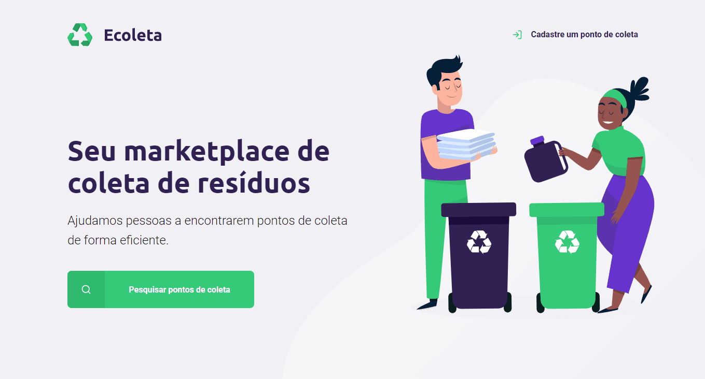

<p align="center">
    
</p>

<p align="center">Find waste collection institutes and turn recycling part of your daily basis</p>

<p align="center">

<a href="https://github.com/diego-aquino">

</a>


<a>

</a>

<a href="./LICENSE">
    
</a>


</p>

<p align="center">
<a href="#rocket-features">Features</a>&nbsp;&nbsp;&nbsp;|&nbsp;&nbsp;&nbsp;
<a href="#gear-technologies">Technologies</a>&nbsp;&nbsp;&nbsp;|&nbsp;&nbsp;&nbsp;
<a href="#computer-getting-started">Getting started</a>&nbsp;&nbsp;&nbsp;|&nbsp;&nbsp;&nbsp;
<a href="#newspaper_roll-license">License</a>&nbsp;&nbsp;&nbsp;|&nbsp;&nbsp;&nbsp;
<a href="#handshake-acknowledgments">Acknowledgments</a>
</p>



## :rocket: Features

- Register waste collection institutions, with support to name, image, address and type of items colleted.
- Search for waste collection sites by city.

## :gear: Technologies

This project was developed with the following technologies:

- [JavaScript](https://developer.mozilla.org/en-US/docs/Web/JavaScript)
- [Node.js](https://nodejs.org/en/) + [Express](https://expressjs.com/), [Nodemon](https://www.npmjs.com/package/nodemon) and [SQLite3](https://github.com/mapbox/node-sqlite3)
- [HTML](https://developer.mozilla.org/en-US/docs/Web/HTML) + [Nunjucks](https://mozilla.github.io/nunjucks/)
- [CSS](https://developer.mozilla.org/en-US/docs/Web/CSS)
- [VS Code](https://code.visualstudio.com/)
- [ScreenToGif](https://www.screentogif.com/), used for recording demonstration GIFs.

## :computer: Getting started

To clone and run this application, you'll need [Git](https://git-scm.com/) and [Node.js](https://nodejs.org/en/) installed on your computer. Then, from your command line:

```bash
# clone this repository
$ git clone https://github.com/diego-aquino/ecoleta.git

# go to the created directory
$ cd ecoleta/

# install all required dependencies automatically
$ npm install

# start local server
$ npm start
```

Now you can visit `http://localhost:3000` to view this project running!

## :newspaper_roll: License

This project if under MIT License. Check [LICENSE](./LICENSE) for more information.

## :handshake: Acknowledgments

This application was developed during the **Next Level Week #1**, an online event hosted by [Rocketseat](https://rocketseat.com.br/), designed to help devs hone their abilities by building a nice project and interacting with the community.
Especial thanks to [Rocketseat](https://rocketseat.com.br/) for creating such a rich learning environment!

---

Made by [Diego Aquino](https://github.com/diego-aquino/) :sunglasses:. [Connect with me!](https://www.linkedin.com/in/diego-aquino) :wave:
